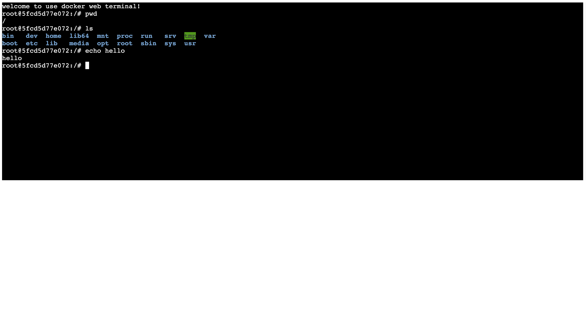

# docker web terminal based on .net core


Usage:

- Config docker daemon to allow remote access

- Start a container to be used in this test, make sure `/bin/bash` works in the container.

- Config `Startup.cs` according to your config

  ```c#
  const string id = "5fcd5d77e072";
  
  var client = new DockerClientConfiguration(new Uri("http://233.233.233.233:2375")).CreateClient();
  ```

- execute following command:

  ```bash
  $ dotnet restore
  
  $ dotnet run
  ```

- visit http://localhost:5000 in your broswer, you shall see this:

  

# 使用dotnetcore的docker web terminal示例

使用方法:

- 配置 docker daemon，允许远程调用API

  - 启动一个测试容器(这里我比较推荐ubuntu:latest)，确保容器可以正常启动 `/bin/bash`

- 配置目录下的 `Startup.cs` ，主要是修改容器的id和你服务器的ip地址

  ```c#
  const string id = "5fcd5d77e072";
  
  var client = new DockerClientConfiguration(new Uri("http://233.233.233.233:2375")).CreateClient();
  ```

- 在命令行执行以下指令：

  ```bash
  $ dotnet restore
  
  $ dotnet run
  ```

- 访问 http://localhost:5000 ，你就应该能看见如下所示的terminal ：）

  